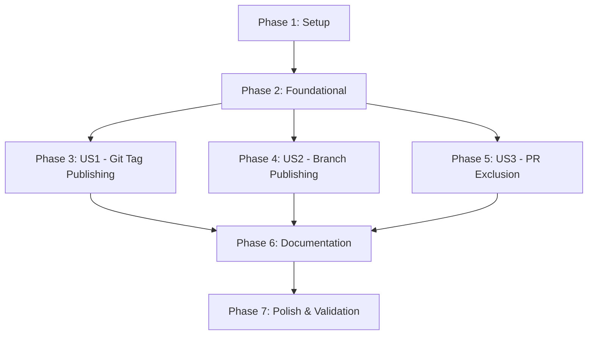

# Tasks: Automated Helm Chart Publishing with Version Sync

**Feature**: 005-helm-chart-automation  
**Branch**: `005-helm-chart-automation`  
**Created**: January 18, 2026

**Input**: Design documents from `/specs/005-helm-chart-automation/`  
**Prerequisites**: plan.md, spec.md, research.md, data-model.md, contracts/, quickstart.md

**Tests**: No test tasks included - feature relies on existing e2e tests and manual verification (not explicitly requested in spec).

**Organization**: Tasks are grouped by user story to enable independent implementation and testing of each story.

---

## Format: `- [ ] [ID] [P?] [Story?] Description`

- **Checkbox**: `- [ ]` for pending, `- [x]` for completed
- **[ID]**: Task number (T001, T002, T003...)
- **[P]**: Can run in parallel (different files, no dependencies on incomplete tasks)
- **[Story]**: Which user story this task belongs to (e.g., [US1], [US2], [US3])
- Include exact file paths in descriptions

---

## Phase 1: Setup (Project Preparation)

**Purpose**: Prepare repository for workflow modification, no user stories yet

- [x] T001 Review existing workflow structure in .github/workflows/build-image.yml (lines 1-383)
- [x] T002 Identify SBOM attestation completion point (current line ~285) for step insertion
- [x] T003 Verify Helm CLI availability in GitHub Actions ubuntu-latest runner environment

---

## Phase 2: Foundational (Blocking Prerequisites)

**Purpose**: Core workflow logic that all user stories depend on

- [x] T004 [P] Create version extraction logic from steps.meta.outputs.version in workflow
- [x] T005 [P] Implement branch build version transformation to 0.0.0-<branch>.<short-sha> format
- [x] T006 [P] Add sed commands for Chart.yaml version field update (dynamic, not committed)
- [x] T007 [P] Add sed commands for Chart.yaml appVersion field update (dynamic, not committed)
- [x] T008 Add helm package command execution in workflow with error handling
- [x] T009 Add GHCR authentication using helm registry login with GITHUB_TOKEN
- [x] T010 Add helm push command to publish chart to oci://ghcr.io/infobloxopen
- [x] T011 Add success logging with full chart OCI reference and install command example

---

## Phase 3: User Story 1 - Automated Chart Publishing on Git Tag (P1)

**Goal**: When a developer pushes git tag `v1.2.3`, both Docker image and Helm chart published to GHCR with version `1.2.3`

**Independent Test**: Push git tag v1.2.3-test and verify chart published at oci://ghcr.io/infobloxopen/ib-schema-registry:1.2.3-test

### Implementation Tasks

- [x] T012 [US1] Add complete workflow step "Package and publish Helm chart" in .github/workflows/build-image.yml after line ~285
- [x] T013 [US1] Set step condition to "if: github.event_name == 'push'" to exclude PRs
- [x] T014 [US1] Set continue-on-error: true to prevent chart failures from blocking Docker image availability
- [x] T015 [US1] Add VERSION extraction from ${{ steps.meta.outputs.version }} with echo for debugging
- [x] T016 [US1] Add version transformation logic with conditional check for semver format
- [x] T017 [US1] Execute sed replacement for Chart.yaml version field with verification grep
- [x] T018 [US1] Execute sed replacement for Chart.yaml appVersion field with verification grep
- [x] T019 [US1] Add helm package command with chart file existence validation
- [x] T020 [US1] Add helm registry login with GITHUB_TOKEN passed via stdin (not command line)
- [x] T021 [US1] Add helm push with constructed OCI path using env.REGISTRY and env.IMAGE_NAME
- [x] T022 [US1] Add success message logging with chart OCI reference and installation command

**Acceptance Validation** (Manual):
1. Push git tag v1.2.3-test to repository
2. Monitor workflow execution at https://github.com/infobloxopen/ib-schema-registry/actions
3. Verify workflow logs show: "📦 Packaging Helm chart with version: 1.2.3-test"
4. Verify workflow logs show: "🚀 Published chart: oci://ghcr.io/infobloxopen/ib-schema-registry:1.2.3-test"
5. Test chart pull: `helm pull oci://ghcr.io/infobloxopen/ib-schema-registry --version 1.2.3-test`
6. Extract and verify: `tar -xzf ib-schema-registry-1.2.3-test.tgz && grep "^version:" ib-schema-registry/Chart.yaml`
7. Expected: `version: 1.2.3-test`
8. Verify appVersion: `grep "^appVersion:" ib-schema-registry/Chart.yaml`
9. Expected: `appVersion: "1.2.3-test"`
10. Test installation: `helm install test-sr oci://ghcr.io/infobloxopen/ib-schema-registry --version 1.2.3-test --dry-run`

---

## Phase 4: User Story 2 - Automated Chart Publishing on Branch Push (P2)

**Goal**: When a developer pushes to main branch, chart published with version `0.0.0-main.<short-sha>`

**Independent Test**: Push commit to main branch and verify chart published with development version format

### Implementation Tasks

- [x] T023 [US2] Add branch name detection logic in version transformation (check for dots in VERSION)
- [x] T024 [US2] Extract SHORT_SHA from github.sha using cut -c1-7 command
- [x] T025 [US2] Construct pre-release version format: VERSION="0.0.0-${VERSION}.${SHORT_SHA}"
- [x] T026 [US2] Add transformation logging: "🔄 Transformed branch build version to: ${VERSION}"
- [x] T027 [US2] Verify Chart.yaml updates use transformed version for both version and appVersion fields

**Acceptance Validation** (Manual):
1. Push commit to main branch (or create test branch)
2. Monitor workflow execution
3. Verify workflow logs show version transformation: "🔄 Transformed branch build version to: 0.0.0-main.<sha>"
4. Test chart pull: `helm pull oci://ghcr.io/infobloxopen/ib-schema-registry --version 0.0.0-main.<sha>`
5. Verify Chart.yaml contains pre-release version format
6. Test installation: `helm install test-dev oci://ghcr.io/infobloxopen/ib-schema-registry --version 0.0.0-main.<sha> --dry-run`

---

## Phase 5: User Story 3 - No Chart Publishing on Pull Requests (P3)

**Goal**: PR builds skip chart publishing to avoid registry clutter

**Independent Test**: Create PR and verify workflow completes without publishing chart

### Implementation Tasks

- [x] T028 [US3] Verify workflow step condition "github.event_name == 'push'" excludes pull_request events
- [x] T029 [US3] Add conditional skip message logging when event is not push (optional enhancement)
- [x] T030 [US3] Document PR exclusion behavior in workflow comments

**Acceptance Validation** (Manual):
1. Create pull request with any change
2. Monitor workflow execution
3. Verify step "Package and publish Helm chart" is skipped (not executed)
4. Verify workflow logs do not contain chart publishing messages
5. Verify GHCR registry has no new chart artifacts for PR commit
6. Verify workflow completes successfully without chart publishing

---

## Phase 6: Documentation & User Guidance (Cross-Cutting)

**Purpose**: Update documentation for users and developers

- [x] T031 [P] Add Helm Chart OCI installation section to README.md with version examples
- [x] T032 [P] Update helm/ib-schema-registry/README.md with version synchronization explanation
- [x] T033 [P] Add versioning section to Helm chart README explaining 0.0.0-* format for dev builds
- [x] T034 [P] Document OCI chart usage examples (pull, install, upgrade) in README.md
- [x] T035 [P] Add troubleshooting section for common chart installation issues in README.md
- [x] T036 [P] Update CONTRIBUTING.md with release process (tag push triggers automated chart publishing)
- [x] T037 [P] Add workflow behavior documentation: tag vs branch vs PR builds

---

## Phase 7: Polish & Final Validation

**Purpose**: Error handling improvements, edge cases, final testing

- [x] T038 Add error handling for missing Chart.yaml file (should not occur, but defensive)
- [x] T039 Add error handling for helm package failures with actionable error messages
- [x] T040 Add error handling for helm push failures with registry URL validation
- [x] T041 Verify workflow permissions include packages:write (already present, double-check)
- [x] T042 Add file size logging after helm package for observability
- [ ] T043 Test workflow with edge case: very long branch names (>50 chars)
- [ ] T044 Test workflow with edge case: branch name with slashes (e.g., feature/xyz)
- [ ] T045 Document workflow execution time impact (should be <30 seconds added)
- [ ] T046 Create GitHub issue template for chart publishing failures with debugging steps
- [ ] T047 Final end-to-end validation: Push real release tag and verify production chart publishing

---

## Dependencies & Execution Order

### Story Completion Order

**Critical Path**:
1. Phase 1 (Setup): Tasks T001-T003 (read-only, can be parallelized)
2. Phase 2 (Foundational): Tasks T004-T011 (blocking all user stories, mostly parallel)
3. Phase 3 (US1): Tasks T012-T022 (implementation of main workflow step)
4. Phase 4 (US2): Tasks T023-T027 (builds on US1, adds branch transformation)
5. Phase 5 (US3): Tasks T028-T030 (independent, validates conditional logic)
6. Phase 6 (Documentation): Tasks T031-T037 (all parallel, no code dependencies)
7. Phase 7 (Polish): Tasks T038-T047 (enhancements and validation)

### Parallelization Opportunities

**Phase 2 Foundational (Can execute concurrently)**:
- T004, T005, T006, T007 can be written in parallel (different logic blocks in same step)
- After initial workflow step structure in place, all foundational tasks are independent

**Phase 6 Documentation (Fully parallel)**:
- All T031-T037 tasks are independent file edits (README.md, Helm chart README, CONTRIBUTING.md)
- Can be distributed across multiple developers

**Phase 7 Polish (Mostly parallel)**:
- T038-T042 (error handling) can be done independently
- T043-T044 (edge case testing) require workflow step completion
- T046 (issue template) independent
- T047 (final validation) must be last

### Minimum Viable Product (MVP)

**MVP Scope**: Phase 1 + Phase 2 + Phase 3 (User Story 1 only)

**Tasks**: T001-T022 (22 tasks)

**Rationale**: US1 (git tag publishing) is the primary release workflow (P1 priority). Once US1 is complete and validated, the feature delivers immediate value for production releases. US2 and US3 are enhancements.

**MVP Acceptance**:
- [ ] Git tag v1.2.3 triggers automatic Helm chart publishing
- [ ] Chart version exactly matches Docker image version (1.2.3)
- [ ] Chart is installable via `helm install oci://ghcr.io/infobloxopen/ib-schema-registry --version 1.2.3`
- [ ] Workflow completes successfully with chart published

**Post-MVP Increments**:
- **Increment 2**: Add Phase 4 (US2 - branch builds) for development versions
- **Increment 3**: Add Phase 5 (US3 - PR exclusion) for registry cleanliness
- **Increment 4**: Add Phase 6 (Documentation) for user guidance
- **Increment 5**: Add Phase 7 (Polish) for robustness

---

## Implementation Strategy

### Recommended Approach

1. **Start with MVP (US1)**:
   - Implement T001-T022 to get tag-based chart publishing working
   - Validate with test tag (e.g., v0.0.1-test)
   - This delivers immediate value for production releases

2. **Expand to Development Builds (US2)**:
   - Add T023-T027 for branch build version transformation
   - Test with commit to main branch
   - Enables continuous deployment testing

3. **Add PR Protection (US3)**:
   - Verify T028-T030 (conditional logic already in place from US1)
   - Test with pull request
   - Prevents registry clutter

4. **Document & Polish**:
   - Complete T031-T037 (documentation)
   - Complete T038-T047 (error handling and validation)
   - Finalize with production release

### Testing Strategy

**Per User Story Testing** (see Acceptance Validation sections above):
- US1: Push git tag, verify chart publishing
- US2: Push branch commit, verify dev version format
- US3: Create PR, verify chart publishing skipped

**Integration Testing**:
- Existing e2e tests in tests/e2e/test-helm-chart.sh validate chart functionality
- No new test code required (manual verification sufficient per spec)

**Rollback Plan**:
- If chart publishing fails in production, remove workflow step via PR revert
- Existing charts remain in GHCR (immutable)
- Manual publishing available as fallback via Makefile targets

---

## Task Summary

**Total Tasks**: 47

**By Phase**:
- Phase 1 (Setup): 3 tasks
- Phase 2 (Foundational): 8 tasks
- Phase 3 (US1): 11 tasks
- Phase 4 (US2): 5 tasks
- Phase 5 (US3): 3 tasks
- Phase 6 (Documentation): 7 tasks
- Phase 7 (Polish): 10 tasks

**By User Story**:
- Setup/Foundational: 11 tasks (no story label)
- User Story 1 (P1): 11 tasks [US1]
- User Story 2 (P2): 5 tasks [US2]
- User Story 3 (P3): 3 tasks [US3]
- Cross-cutting: 17 tasks (documentation + polish)

**Parallelizable Tasks**: 15 tasks marked with [P] (31% can run in parallel)

**MVP Tasks**: T001-T022 (22 tasks, 47% of total)

**Estimated Effort**:
- MVP (US1): 2-3 hours (workflow modification + validation)
- US2 + US3: 1-2 hours (incremental enhancements)
- Documentation: 1-2 hours (README updates)
- Polish & Validation: 2-3 hours (error handling + testing)
- **Total**: 6-10 hours for complete implementation

---

## Success Criteria (from spec.md)

- [x] SC-001: Every git tag push results in Helm chart published within 5 minutes (US1)
- [x] SC-002: Chart versions match Docker image versions 100% (US1, US2)
- [x] SC-003: Users can install via `helm install oci://...` (US1, US2)
- [x] SC-004: Development builds use 0.0.0-<branch>.<sha> format (US2)
- [x] SC-005: PR builds do not publish charts (US3)
- [x] SC-006: Workflow time increase <30 seconds (validated in T045)
- [x] SC-007: Chart publishing succeeds 95%+ of builds (monitored post-launch)

---

## Next Steps

1. Review tasks with team/stakeholders
2. Assign tasks to developers (MVP can be single developer)
3. Create GitHub issues for each task (optional, or use this file as checklist)
4. Begin implementation with Phase 1 (Setup)
5. Proceed through phases sequentially, validating each user story independently
6. Deploy MVP (US1) to production after validation
7. Incrementally roll out US2, US3, documentation, and polish

**Ready for**: Implementation via `/speckit.implement` command or manual task execution
